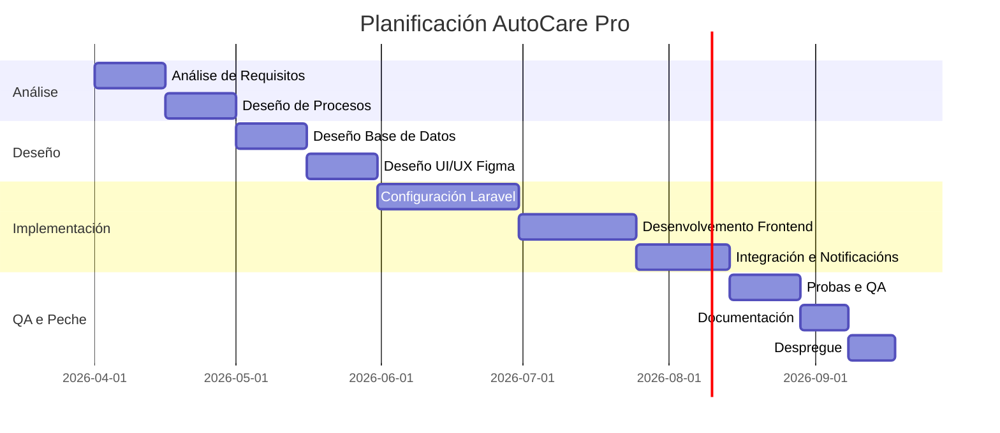

# Anteproxecto

- [Anteproxecto](#anteproxecto)
  - [1- Idea do proxecto](#1--idea-do-proxecto)
  - [2- Contextualización](#2--contextualización)
  - [3- Estudio de alternativas e viabilidade](#3--estudio-de-alternativas-e-viabilidade)
    - [3.1- Estudio de alternativas](#31--estudio-de-alternativas)
    - [3.2 Xustificación da alternativa](#32-xustificación-da-alternativa)
  - [4- Requirimentos técnicos](#4--requirimentos-técnicos)
  - [5- Planificación](#5--planificación)

## 1- Idea do proxecto

A idea do proxecto consiste no desenvolvemento dunha **páxina web de xestión integral** para talleres mecánicos, denominada **AutoCare Pro**. Trátase dunha plataforma accesible dende calquera navegador que permite aos profesionais do sector dixitalizar a xestión dos seus servizos.

A web funcionará como un panel de control onde o mecánico pode rexistrar entradas de vehículos, xerar orzamentos e actualizar o progreso das reparacións. Pola súa banda, os clientes poderán acceder a unha sección pública da web para consultar, mediante un código privado, o estado actual do seu coche, achegando transparencia e modernidade ao servizo.

## 2- Contextualización

Este proxecto responde a necesidade de moitos talleres pequenos de contar cunha presenza dixital funcional que vaia máis alá dunha simple web informativa.

- **En que consiste o proxecto?** É unha plataforma web de xestión (Backoffice) e consulta (Frontend). O propósito principal é centralizar toda a actividade do taller nunha ferramenta na nube accesible dende o ordenador do taller ou tablets.

## 3- Estudio de alternativas e viabilidade

### 3.1- Estudio de alternativas

Analizamos diversas tecnoloxías web para o desenvolvemento de **AutoCare Pro**:

| **Alternativa** | **Viabilidade técnica** | **Viabilidade económica** | **Temporalidade** | **Valoración Global** |
| ------ | ------ | ------ | ------ | ------ |
| **A1: Java Spring Boot + React** | Baixa-media (4/10): Arquitectura sólida pero excesivamente complexa para o tempo dispoñible no ciclo de DAW. | Media (6/10): Require hosting especializado para Java. | Baixa (3/10): Curva de aprendizaxe moi pronunciada. | **4.5/10** |
| **A2: Node.js + React** | Media-Alta (7/10): Moi fluída pero require moito esforzo en configurar a seguridade e a estrutura do servidor dende cero. | Alta (8/10): Hosting económico en plataformas cloud. | Media (6/10): Estimado en 4-5 meses. | **7.0/10** |
| **A3: PHP (Laravel) + Tailwind** | **Alta (9/10):** É a opción máis equilibrada. Laravel ofrece ferramentas integradas (Eloquent, Blade, Auth) que aceleran o desenvolvemento. | **Alta (9/10):** Hosting compartido moi barato e accesible. | **Alta (9/10):** Permite ter un MVP funcional en 3 meses. | **9/10** |

### 3.2 Xustificación da alternativa

Tras analizar as opcións, a alternativa elixida é a **A3 (Laravel)**. Esta decisión fundaméntase en que Laravel permite construír unha aplicación robusta e escalable en moito menos tempo que as alternativas A1 ou A2, grazas á súa filosofía de "desenvolvemento rápido". Ao ser un proxecto de xestión con moita interacción coa base de datos, o ORM Eloquent de Laravel facilita a integridade dos datos sen a complexidade técnica de Spring Boot.

## 4- Requirimentos técnicos

Para que a páxina web sexa funcional e profesional, defínense os seguintes requisitos técnicos:

- **Infraestrutura:**
  - **Hosting:** Servidor Linux con soporte para PHP 8.2+, MySQL 8.0, 2GB de RAM e 20GB de almacenamento SSD.
  - **Dominio:** Rexistro de dominio `.com` ou `.es` con certificado **SSL (HTTPS)** activo para a protección de datos dos clientes.
- **Backend:**
  - Framework **Laravel (PHP)** para a lóxica de negocio.
  - Motor de modelos **Blade** para a xeración dinámica das vistas dende o lado do servidor.
- **Frontend:**
  - **HTML5** e **Tailwind CSS** para un deseño responsivo e moderno.
  - **JavaScript** para interaccións dinámicas na interface de usuario.
- **Base de Datos:**
  - **MySQL** con deseño relacional para a xestión de clientes, vehículos e orzamentos.

## 5- Planificación

A planificación detalla as fases necesarias para o desenvolvemento completo do software, dende o estudo inicial ata o despregue final:

---

[**<-Anterior**](../README.md)
