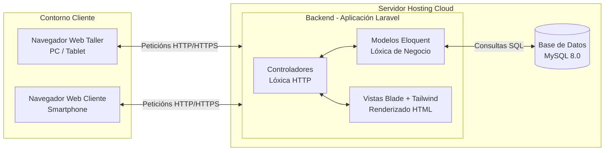
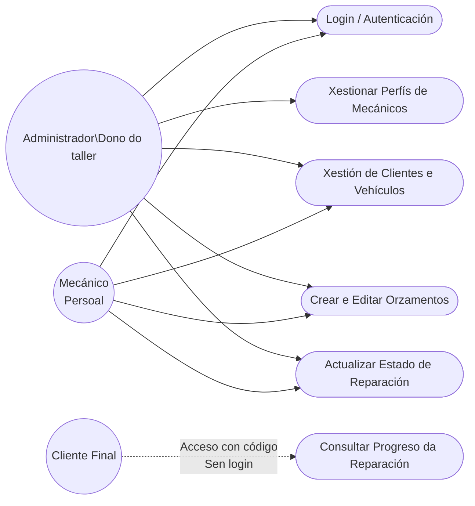
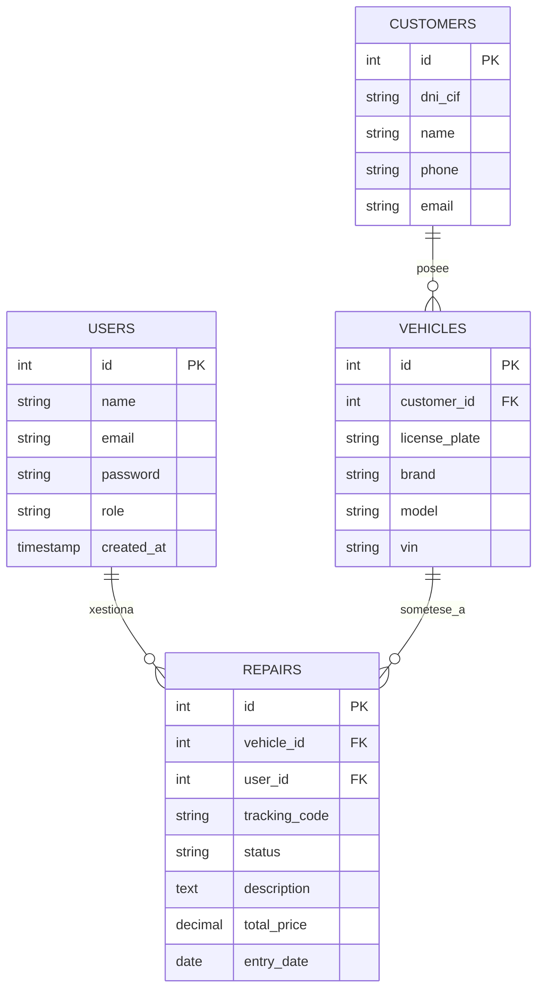
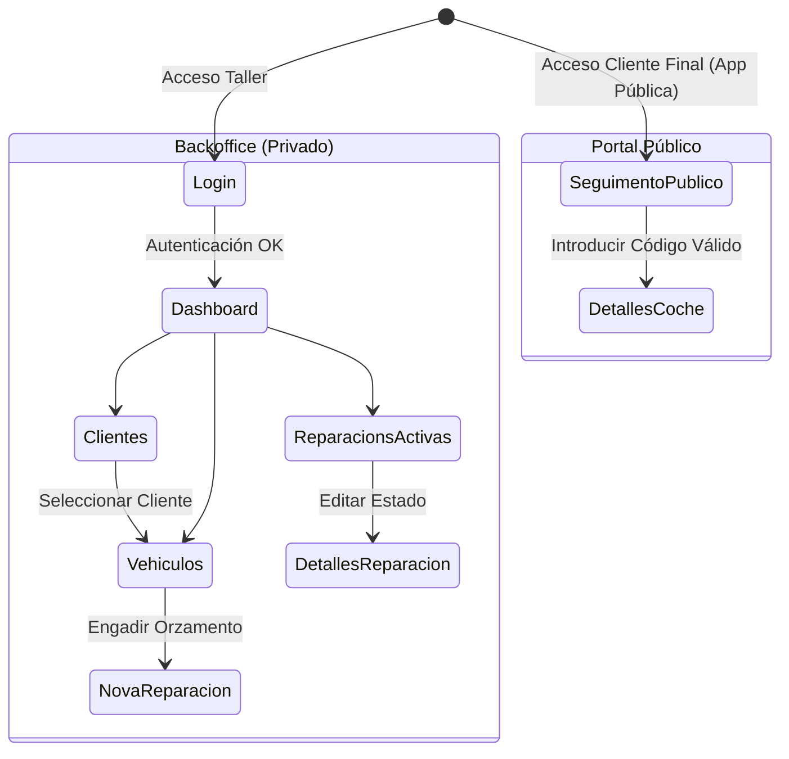

# FASE DE DESEÑO

- [FASE DE DESEÑO](#fase-de-deseño)
  - [1- Diagrama da arquitectura](#1--diagrama-da-arquitectura)
  - [2- Casos de uso](#2--casos-de-uso)
  - [3- Diagrama de Base de Datos](#3--diagrama-de-base-de-datos)
    - [3.1- Modelo Entidade-Relación (ER)](#31--modelo-entidade-relación-er)
    - [3.2- Modelo Relacional](#32--modelo-relacional)
  - [4- Deseño de interface de usuarios](#4--deseño-de-interface-de-usuarios)
    - [4.1- Mapa de Navegación](#41--mapa-de-navegación)
    - [4.2- Estrutura das Vistas (Wireframes)](#42--estrutura-das-vistas-wireframes)
      - [Vista: Dashboard Principal (Modo Desktop)](#vista-dashboard-principal-modo-desktop)
      - [Vista: Ficha da Reparación (Edición do Mecánico)](#vista-ficha-da-reparación-edición-do-mecánico)
      - [Vista: Portal do Cliente (Público - Optimizado para Móbil)](#vista-portal-do-cliente-público---optimizado-para-móbil)

## 1- Diagrama da arquitectura

O proxecto **AutoCare Pro** baséase nunha arquitectura **MVC (Modelo-Vista-Controlador)** clásica, orquestrada polo framework **Laravel**. Esta arquitectura permite separar a lóxica de negocio, a base de datos e a interface de usuario, garantindo escalabilidade e facilidade de mantemento.

## 2- Casos de uso

O seguinte diagrama detalla as interaccións dos tres actores principais do sistema (Administrador, Mecánico e Cliente Final) coas distintas funcionalidades da plataforma.

## 3- Diagrama de Base de Datos

### 3.1- Modelo Entidade-Relación (ER)

Para soportar as funcionalidades descritas, a base de datos estrutúrase arredor de catro entidades principais: `Usuarios` (persoal do taller), `Clientes` (propietarios dos coches), `Vehículos` e `Reparacións` (que inclúen orzamentos e seguimento).

### 3.2- Modelo Relacional

- **users** (id, name, email, password, role, created_at, updated_at)
- **customers** (id, dni_cif, name, phone, email, created_at, updated_at)
- **vehicles** (id, customer_id*, license_plate, brand, model, vin)
- **repairs** (id, vehicle_id*, user_id*, tracking_code, status, description, total_price, entry_date)

## 4- Deseño de interface de usuarios

### 4.1- Mapa de Navegación

O fluxo de navegación está dividido en dous ecosistemas: o privado (Backoffice) e o público (Frontend).

### 4.2- Estrutura das Vistas (Wireframes)

A interface desenvolverase cun enfoque *Mobile-First* utilizando Tailwind CSS. Abaixo descríbese o layout das vistas principais:

#### Vista: Dashboard Principal (Modo Desktop)

- **Sidebar Esquerdo:** Menú de navegación principal (Inicio, Clientes, Vehículos, Orzamentos, Configuración, Logout).
- **Cabeceira (Header):** Nome do usuario actual, rol e barra de búsqueda rápida por matrícula.
- **Corpo Central:**
  - Tarxetas resumo (KPIs): "Vehículos no taller: 12", "Orzamentos pendentes: 3", "Ingresos mes: 4.500€" (Só admin).
  - Táboa de "Últimas reparacións en curso" con distintivos de cores segundo o estado (Gris: Pendente, Amarelo: En curso, Verde: Rematado).

#### Vista: Ficha da Reparación (Edición do Mecánico)

- **Datos Xerais:** Matrícula, modelo e propietario.
- **Selector de Estado:** Un desplegable (Dropdown) para cambiar o estado do vehículo de forma rápida.
- **Orzamento:** Unha táboa dinámica con campos para "Concepto", "Cantidade", "Prezo Unitario" e "Total". Botón de "Engadir liña".
- **Botón Gardar:** Ao pulsar, ademais de gardar na BD, pódense disparar as notificacións pertinentes.

#### Vista: Portal do Cliente (Público - Optimizado para Móbil)

- **Deseño Limpo:** Logo de AutoCare Pro (ou do taller) e un fondo neutro.
- **Centro da pantalla:** Input text grande para introducir o **"Código de Seguimento"** e un botón "Consultar".
- **Ao introducir o código:**
  - Amósase un *Timeline* (liña temporal) vertical:
    - [x] Vehículo recibido (01/05/2026)
    - [x] Diagnosticando avaría (02/05/2026)
    - [ ] Reparación en curso (Actual)
    - [ ] Listo para recoller
  - Prezo estimado do orzamento (se o taller decide mostralo).

---

[**<-Anterior**](../../README.md)
